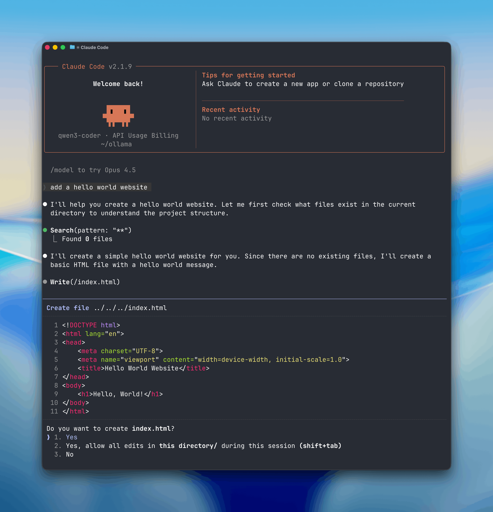
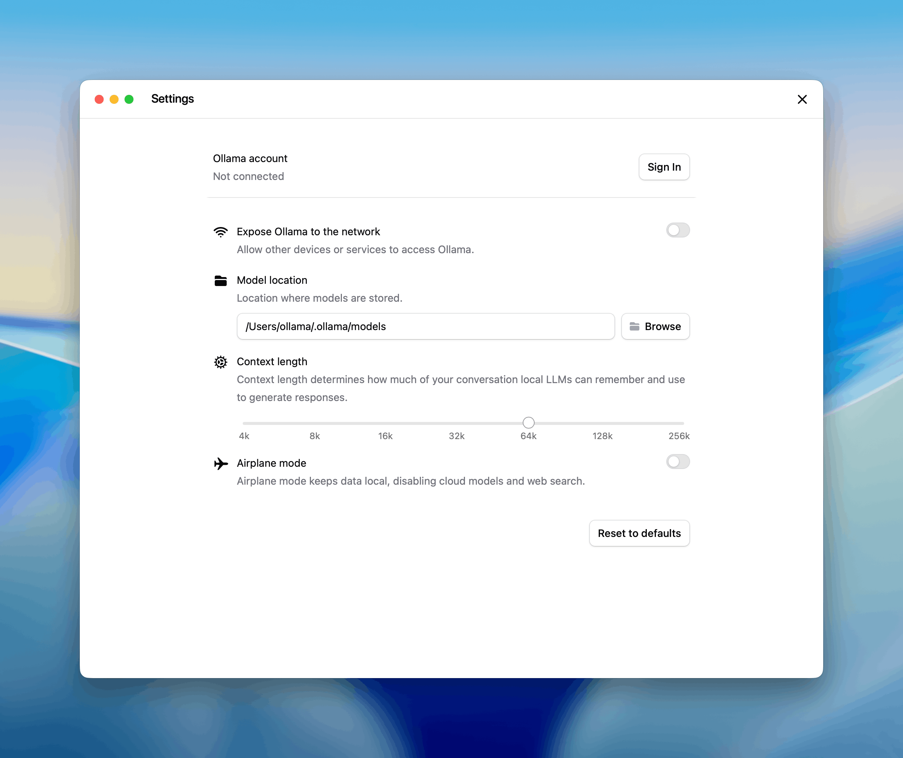

# Claude Code with Anthropic API compatibility
Claude Code 与 Anthropic API 的兼容性

* https://ollama.com/blog/claude

2026年1月16日



Ollama `v0.14.0` and later are now compatible with the Anthropic [Messages API](https://docs.anthropic.com/en/api/messages), making it possible to use tools like [Claude Code](https://docs.anthropic.com/en/docs/claude-code) with open-source models.
Ollama v0.14.0 及更高版本现在与 Anthropic Messages API 兼容, 使得将 Claude Code 等工具与开源模型结合使用成为可能.

Run Claude Code with local models on your machine, or connect to cloud models through ollama.com.
在您的计算机上使用本地模型运行 Claude Code, 或通过 ollama.com 连接到云模型.

## Using Claude Code with Ollama
使用 Claude Code 和 Ollama

Claude Code is Anthropic's agentic coding tool that lives in your terminal. With Anthropic API support, you can now use Claude Code with any Ollama model.
Claude Code 是 Anthropic 公司开发的智能体编码工具, 它驻留在您的终端中. 借助 Anthropic API 的支持, 您现在可以将 Claude Code 与任何 Ollama 模型配合使用.

### Get started
开始使用

**Install Claude Code**
安装 Claude Code

macOS, Linux, WSL:

```bash
curl -fsSL https://claude.ai/install.sh | bash
```

Windows PowerShell:

```bash
irm https://claude.ai/install.ps1 | iex
```

Windows CMD:

```bash
curl -fsSL https://claude.ai/install.cmd -o install.cmd && install.cmd && del install.cmd
```

**Connect Ollama**

Configure environment variables to use Ollama:
配置环境变量以使用 Ollama:

```
export ANTHROPIC_AUTH_TOKEN=ollama
export ANTHROPIC_BASE_URL=http://localhost:11434
```

Run Claude Code with an Ollama model:
使用 Ollama 模型运行 Claude Code:

```
claude --model gpt-oss:20b
```

Models in Ollama's Cloud also work with Claude Code:
Ollama 云端的模型也适用于 Claude 代码:

```
claude --model glm-4.7:cloud
```

It is recommended to run a model with at least 32K tokens context length.
建议运行模型时, 上下文长度至少为 32K 个 token.



For more information, please see [context length documentation](https://docs.ollama.com/context-length) on how to make changes.
有关如何进行更改的更多信息, 请参阅[上下文长度文档](https://docs.ollama.com/context-length).

Ollama's cloud models always run at their full context length.
Ollama 的云模型始终以其完整的上下文长度运行.

## Recommended models

For coding use cases with Claude Code:
Claude Code 的编码用例:

**Local models:**

- `gpt-oss:20b`

- `qwen3-coder`

**Cloud models:**

- `glm-4.7:cloud`

- `minimax-m2.1:cloud`

## Using the Anthropic SDK
使用 Anthropic SDK

Existing applications using the Anthropic SDK can connect to Ollama by changing the base URL. See the [Anthropic compatibility documentation](https://docs.ollama.com/api/anthropic-compatibility) for details.
使用 Anthropic SDK 的现有应用程序可以通过更改基本 URL 连接到 Ollama. 有关详细信息, 请参阅 [Anthropic 兼容性文档](https://docs.ollama.com/api/anthropic-compatibility).

### Python

```python
import anthropic

client = anthropic.Anthropic(
    base_url='http://localhost:11434',
    api_key='ollama',  # required but ignored
)

message = client.messages.create(
    model='qwen3-coder',
    messages=[
        {'role': 'user', 'content': 'Write a function to check if a number is prime'}
    ]
)
print(message.content[0].text)
```

### JavaScript

```javascript
import Anthropic from '@anthropic-ai/sdk'

const anthropic = new Anthropic({
  baseURL: 'http://localhost:11434',
  apiKey: 'ollama',
})

const message = await anthropic.messages.create({
  model: 'qwen3-coder',
  messages: [{ role: 'user', content: 'Write a function to check if a number is prime' }],
})

console.log(message.content[0].text)
```

## Tool calling

Models can use tools to interact with external systems:
模型可以使用工具与外部系统进行交互:

```python
import anthropic

client = anthropic.Anthropic(
    base_url='http://localhost:11434',
    api_key='ollama',
)

message = client.messages.create(
    model='qwen3-coder',
    tools=[
        {
            'name': 'get_weather',
            'description': 'Get the current weather in a location',
            'input_schema': {
                'type': 'object',
                'properties': {
                    'location': {
                        'type': 'string',
                        'description': 'The city and state, e.g. San Francisco, CA'
                    }
                },
                'required': ['location']
            }
        }
    ],
    messages=[{'role': 'user', 'content': "What's the weather in San Francisco?"}]
)

for block in message.content:
    if block.type == 'tool_use':
        print(f'Tool: {block.name}')
        print(f'Input: {block.input}')
```

## Supported features
支持的功能

- Messages and multi-turn conversations
  消息和多轮对话

- Streaming
  流媒体

- System prompts
  系统提示

- Tool calling / function calling
  工具调用/函数调用

- Extended thinking
  拓展思维

- Vision (image input)
  视觉(图像输入)

For a complete list of supported features, see the [Anthropic compatibility documentation](https://docs.ollama.com/api/anthropic-compatibility).
有关支持功能的完整列表, 请参阅 [Anthropic 兼容性文档](https://docs.ollama.com/api/anthropic-compatibility).

## Learn more

For more detailed setup instructions and configuration options, see the [Claude Code guide](https://docs.ollama.com/integrations/claude-code).
有关更详细的设置说明和配置选项, 请参阅 [Claude Code 指南](https://docs.ollama.com/integrations/claude-code).
