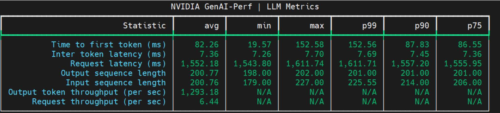
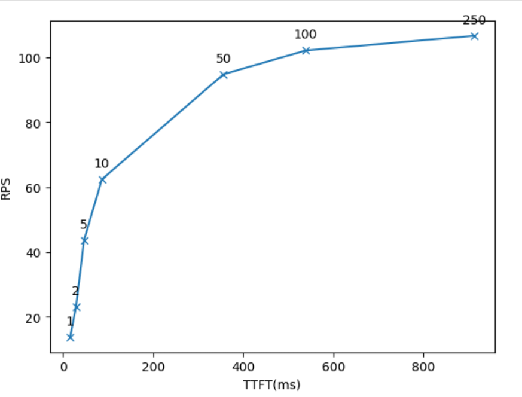

# LLM Inference Benchmarking Guide: NVIDIA GenAI-Perf and NIM
LLM 推理基准测试指南: NVIDIA GenAI-Perf 和 NIM

* https://developer.nvidia.com/blog/llm-performance-benchmarking-measuring-nvidia-nim-performance-with-genai-perf/

This is the second post in the [LLM Benchmarking](https://developer.nvidia.com/blog/tag/llm-benchmarking/) series, which shows how to use GenAI-Perf to benchmark the Meta Llama 3 model when deployed with [NVIDIA NIM](https://www.nvidia.com/en-us/ai/).
这是 [LLM 基准测试](https://developer.nvidia.com/blog/tag/llm-benchmarking/)系列的第二篇文章, 展示了如何使用 GenAI-Perf 对部署在 [NVIDIA NIM](https://www.nvidia.com/en-us/ai/) 上的 Meta Llama 3 模型进行基准测试.

- [Part 1: LLM Inference Benchmarking: Fundamental Concepts](https://developer.nvidia.com/blog/llm-benchmarking-fundamental-concepts/)
  第一部分: LLM 推理基准测试: 基本概念

When building LLM-based applications, it is critical to understand the performance characteristics of these models on a given hardware. This serves multiple purposes:
构建基于 LLM 的应用程序时, 了解这些模型在特定硬件上的性能特征至关重要. 这有以下几个目的:

- Identifying the bottleneck and potential optimization opportunities
  找出瓶颈和潜在的优化机会

- Identifying the quality of service and throughput tradeoff
  确定服务质量和吞吐量之间的权衡

- Infrastructure provisioning
  基础设施配置

As a client-side LLM-focused benchmarking tool, [NVIDIA GenAI-Perf](https://docs.nvidia.com/deeplearning/triton-inference-server/user-guide/docs/perf_analyzer/genai-perf/README.html) provides key metrics:
作为一款面向客户端 LLM 的基准测试工具, [NVIDIA GenAI-Perf](https://docs.nvidia.com/deeplearning/triton-inference-server/user-guide/docs/perf_analyzer/genai-perf/README.html) 提供关键指标:

- Time to first token (TTFT)
  首次 token 到达时间(TTFT)

- Inter-token latency (ITL)
  token 间延迟 (ITL)

- Tokens per second (TPS)
  每秒 token 数 (TPS)

- Requests per second (RPS)
  每秒请求数 (RPS)

- …and more

GenAI-Perf also supports any LLM inference service conforming to the OpenAI API [specification](https://openai.com/index/openai-api/), a widely accepted default standard in the industry.
GenAI-Perf 还支持任何符合 OpenAI API [规范的](https://openai.com/index/openai-api/) LLM 推理服务, 这是业界广泛接受的默认标准.

For this benchmarking guide, we used [NVIDIA NIM](https://www.nvidia.com/en-us/ai/#referrer=ai-subdomain), a collection of inference microservices that offer high-throughput and low-latency inference for both base and fine-tuned LLMs. NIM features ease-of-use and enterprise-grade security and manageability.
在本基准测试指南中, 我们使用了 [NVIDIA NIM](https://www.nvidia.com/en-us/ai/#referrer=ai-subdomain), 它是一套推理微服务, 可为基础和微调后的 LLM 提供高吞吐量和低延迟的推理. NIM 具有易用性以及企业级安全性和可管理性.

To optimize your AI application, this post walks through the process of setting up a NIM inference microservice for Llama 3, using GenAI-Perf to measure the performance, and analyzing the outputs.
为了优化您的 AI 应用程序, 本文将逐步介绍如何为 Llama 3 设置 NIM 推理微服务, 使用 GenAI-Perf 来衡量性能, 并分析输出结果.

As NIM and GenAI-Perf evolve, see the [Using GenAI-Perf to Benchmark](https://docs.nvidia.com/nim/benchmarking/llm/latest/step-by-step.html) documentation.
随着 NIM 和 GenAI-Perf 的发展, 请参阅[使用 GenAI-Perf 进行基准测试](https://docs.nvidia.com/nim/benchmarking/llm/latest/step-by-step.html) 文档.

## Why use GenAI-Perf for benchmarking model performance?
为什么使用 GenAI-Perf 来评估模型性能?

NVIDIA NIM microservices are prepackaged, optimized containers that make it easy to deploy and run AI models across various platforms, including clouds, data centers, and NVIDIA RTX AI PCs, accelerating [generative AI](https://www.nvidia.com/en-us/glossary/generative-ai/) development for any domain. NIM LLMs are powered by industry-leading backends, including TensorRT-LLM and vLLM. NIM is continually improved to provide optimal performance even on the same hardware generation.
NVIDIA NIM 微服务是预打包、优化的容器, 可轻松在包括云、数据中心和 NVIDIA RTX AI PC 在内的各种平台上部署和运行 AI 模型, 从而加速任何领域的[生成式 AI](https://www.nvidia.com/en-us/glossary/generative-ai/) 开发. NIM LLM 由业界领先的后端提供支持, 包括 TensorRT-LLM 和 vLLM. NIM 不断改进, 即使在同一代硬件上也能提供最佳性能.

GenAI-Perf enables you to not only reproduce and validate these performance results but to do benchmarking using your own hardware. For more information about this process, see [NVIDIA NIM Performance](https://docs.nvidia.com/nim/benchmarking/llm/latest/performance.html).
GenAI-Perf 不仅能让您重现和验证这些性能结果, 还能让您使用自己的硬件进行基准测试. 有关此过程的更多信息, 请参阅 [NVIDIA NIM 性能](https://docs.nvidia.com/nim/benchmarking/llm/latest/performance.html).

## Steps for benchmarking with NIM
使用 NIM 进行基准测试的步骤

All the performance figures on the [NIM Performance](https://docs.nvidia.com/nim/benchmarking/llm/latest/performance.html) page were collected with the NVIDIA GenAI-Perf tool. Following the step-by-step recipe presented in the rest of this post, you can reproduce these performance numbers, as well as benchmark models on your own hardware.
[NIM 性能](https://docs.nvidia.com/nim/benchmarking/llm/latest/performance.html)页面上的所有性能数据均使用 NVIDIA GenAI-Perf 工具采集. 按照本文后续步骤操作, 您可以在自己的硬件上复现这些性能数据以及其他基准测试模型.

### Setting up an OpenAI-compatible Llama-3 inference service with NIM
使用 NIM 搭建与 OpenAI 兼容的 Llama-3 推理服务

NIM provides the easiest and quickest way to put LLMs and other AI foundation models into production. For more information, see [A Simple Guide to Deploying Generative AI with NVIDIA NIM](https://developer.nvidia.com/blog/a-simple-guide-to-deploying-generative-ai-with-nvidia-nim/) or the latest [NVIDIA NIM for Large Language Models](https://docs.nvidia.com/nim/large-language-models/latest/getting-started.html) documentation, which walks you through the hardware requirements and prerequisites, including [NVIDIA NGC](https://docs.nvidia.com/nim/large-language-models/latest/getting-started.html#option-2-from-ngc) API keys.
NIM 提供了一种最简便快捷的方式, 将 LLM 和其他 AI 基础模型投入生产环境. 如需了解更多信息, 请参阅 [使用 NVIDIA NIM 部署生成式 AI 简易指南](https://developer.nvidia.com/blog/a-simple-guide-to-deploying-generative-ai-with-nvidia-nim/) 或最新的 [NVIDIA NIM for Large Language Models](https://docs.nvidia.com/nim/large-language-models/latest/getting-started.html) 文档, 其中详细介绍了硬件要求和先决条件, 包括 [NVIDIA NGC](https://docs.nvidia.com/nim/large-language-models/latest/getting-started.html#option-2-from-ngc) API 密钥.

Use the following commands to deploy NIM and execute inference:
使用以下命令部署 NIM 并执行推理:

```bash
export NGC_API_KEY=<YOUR_NGC_API_KEY>

# Choose a container name for bookkeeping
export CONTAINER_NAME=llama-3.1-8b-instruct

# Choose a LLM NIM Image from NGC
export IMG_NAME="nvcr.io/nim/meta/${CONTAINER_NAME}:latest"

# Choose a path on your system to cache the downloaded models
export LOCAL_NIM_CACHE=./cache/nim
mkdir -p "$LOCAL_NIM_CACHE"

# Start the LLM NIM
docker run -it --rm --name=$CONTAINER_NAME \
  --gpus all \
  --shm-size=16GB \
  -e NGC_API_KEY \
  -v "$LOCAL_NIM_CACHE:/opt/nim/.cache" \
  -u $(id -u) \
  -p 8000:8000 \
  $IMG_NAME
```

In this code example, we specified the Meta Llama-3.1-8b-Instruct model, which is also the name of the container. We also provided and mounted a local directory as a cache directory where downloaded model assets are persisted.
在这个代码示例中, 我们指定了 Meta Llama-3.1-8b-Instruct 模型, 该模型也是容器的名称. 我们还提供并挂载了一个本地目录作为缓存目录, 用于保存下载的模型资源.

During startup, the NIM container downloads the required resources and begins serving the model behind an API endpoint. The following message indicates a successful startup:
启动过程中, NIM 容器会下载所需资源, 并开始通过 API 端点提供模型服务. 以下消息表示启动成功:

```bash
INFO: Application startup complete.

INFO: Uvicorn running on http://0.0.0.0:8000 (Press CTRL+C to quit)
```

When running, NIM provides an OpenAI-compatible API that you can query:
运行时, NIM 提供了一个与 OpenAI 兼容的 API, 您可以对其进行查询:

```python
from openai import OpenAI
client = OpenAI(base_url="http://0.0.0.0:8000/v1", api_key="not-used")
prompt = "Once upon a time"
response = client.completions.create(
    model="meta/llama-3.1-8b-instruct",
    prompt=prompt,
    max_tokens=16,
    stream=False
)
completion = response.choices[0].text
print(completion)
```

### Setting up GenAI-Perf and benchmarking a single use case
搭建 GenAI-Perf 并针对单个用例进行基准测试

Now that you have the NIM Llama-3 inference service running, next set up the benchmarking tool.
现在 NIM Llama-3 推理服务已经运行, 接下来设置基准测试工具.

The easiest way to do this is using a prebuilt Docker container. We recommend starting a GenAI-Perf container on the same server as NIM to avoid network latency, unless you specifically want to factor in the network latency as part of the measurement.
最简单的方法是使用预构建的 Docker 容器. 我们建议在与 NIM 相同的服务器上启动 GenAI-Perf 容器, 以避免网络延迟, 除非您特别希望将网络延迟纳入测量范围.

For more information about getting started, see the [GenAI-Perf](https://docs.nvidia.com/deeplearning/triton-inference-server/user-guide/docs/client/src/c%2B%2B/perf_analyzer/genai-perf/README.html#installation) documentation.
有关入门的更多信息, 请参阅 [GenAI-Perf](https://docs.nvidia.com/deeplearning/triton-inference-server/user-guide/docs/client/src/c%2B%2B/perf_analyzer/genai-perf/README.html#installation) 文档.

Run the following commands to use the prebuilt container.
运行以下命令以使用预构建容器.

```bash
export RELEASE="24.12" # recommend using latest releases in yy.mm format

docker run -it --net=host --gpus=all -v $PWD:/workdir nvcr.io/nvidia/tritonserver:${RELEASE}-py3-sdk
```

You should mount a directory from the host machine into the container, so that benchmarking assets can be persisted. In the earlier example, we mounted the current directory.
您应该将主机上的一个目录挂载到容器中, 以便持久化基准测试资源. 在之前的示例中, 我们挂载了当前目录.

Inside the container, you can fire up the GenAI-Perf evaluation harness as follows, which carries out a warming load test on the NIM backend:
在容器内, 您可以按如下方式启动 GenAI-Perf 评估框架, 该框架会对 NIM 后端执行预热负载测试:

```bash
export INPUT_SEQUENCE_LENGTH=200
export INPUT_SEQUENCE_STD=10
export OUTPUT_SEQUENCE_LENGTH=200
export CONCURRENCY=10
export MODEL=meta/llama-3.1-8b-instruct

genai-perf profile \
    -m $MODEL \
    --endpoint-type chat \
    --service-kind openai \
    --streaming \
    -u localhost:8000 \
    --synthetic-input-tokens-mean $INPUT_SEQUENCE_LENGTH \
    --synthetic-input-tokens-stddev $INPUT_SEQUENCE_STD \
    --concurrency $CONCURRENCY \
    --output-tokens-mean $OUTPUT_SEQUENCE_LENGTH \
    --extra-inputs max_tokens:$OUTPUT_SEQUENCE_LENGTH \
    --extra-inputs min_tokens:$OUTPUT_SEQUENCE_LENGTH \
    --extra-inputs ignore_eos:true \
    --tokenizer meta-llama/Meta-Llama-3.1-8B-Instruct \
    -- \
    -v \
    --max-threads=256
```

In this minimal example, we specified the input and output sequence length and a concurrency to test. We also asked the backend to ignore the special EOS tokens, so that the output reaches the intended length.
在这个最小示例中, 我们指定了输入和输出序列的长度以及要测试的并发数. 我们还要求后端忽略特殊的 EOS token, 以便输出达到预期的长度.

This test uses the [Llama-3 tokenizer](https://huggingface.co/meta-llama/Meta-Llama-3-8B-Instruct) from Hugging Face, which is a guarded repository. You must apply for access and then log in with your Hugging Face credential.
此测试使用 Hugging Face 提供的 [Llama-3 分词器](https://huggingface.co/meta-llama/Meta-Llama-3-8B-Instruct), 该代码库受保护. 您必须申请访问权限, 然后使用您的 Hugging Face 凭据登录.

```bash
pip install huggingface_hub

huggingface-cli login
```

For more information about the full set of options and parameters, see the [GenAI-Perf](https://docs.nvidia.com/deeplearning/triton-inference-server/user-guide/docs/perf_analyzer/genai-perf/README.html) documentation.
有关所有选项和参数的更多信息, 请参阅 [GenAI-Perf](https://docs.nvidia.com/deeplearning/triton-inference-server/user-guide/docs/perf_analyzer/genai-perf/README.html) 文档.

Upon successful execution, you should see results similar to the following in the terminal:
执行成功后, 您应该会在终端中看到类似以下内容的结果:



### Sweeping through several use cases
浏览多个用例

With benchmarking, a test would typically be set up to sweep over, or execute, several use cases (input and output length combinations) and load scenarios (different concurrency values). Using the following BASH script, define the parameters so that GenAI-Perf executes through all the combinations.
基准测试通常会设置一个测试用例, 以涵盖或执行多个用例(输入和输出长度组合)和负载场景(不同的并发值). 请使用以下 BASH 脚本定义参数, 以便 GenAI-Perf 能够执行所有组合的测试.

Before doing a benchmarking sweep, we recommend running a warm-up test. In our case, we did this while setting up GenAI-Perf and a single use case.
在进行基准测试之前, 我们建议先运行预热测试. 在本例中, 我们在设置 GenAI-Perf 和一个单一用例的同时进行了预热测试.

In the GenAI-Perf container, run the following command:
在 GenAI-Perf 容器中, 运行以下命令:

```bash
bash benchmark.sh
```

Here's the `benchmark.sh` script:
以下是 `benchmark.sh` 脚本:

```bash
declare -A useCases

# Populate the array with use case descriptions and their specified input/output lengths
useCases["Translation"]="200/200"
useCases["Text classification"]="200/5"
useCases["Text summary"]="1000/200"
useCases["Code generation"]="200/1000"

# Function to execute genAI-perf with the input/output lengths as arguments
runBenchmark() {
    local description="$1"
    local lengths="${useCases[$description]}"
    IFS='/' read -r inputLength outputLength <<< "$lengths"

    echo "Running genAI-perf for $description with input length $inputLength and output length $outputLength"
    # Runs
    for concurrency in 1 2 5 10 50 100 250; do

        local INPUT_SEQUENCE_LENGTH=$inputLength
        local INPUT_SEQUENCE_STD=0
        local OUTPUT_SEQUENCE_LENGTH=$outputLength
        local CONCURRENCY=$concurrency
        local MODEL=meta/llama-3.1-8b-instruct

        genai-perf profile \
            -m $MODEL \
            --endpoint-type chat \
            --service-kind openai \
            --streaming \
            -u localhost:8000 \
            --synthetic-input-tokens-mean $INPUT_SEQUENCE_LENGTH \
            --synthetic-input-tokens-stddev $INPUT_SEQUENCE_STD \
            --concurrency $CONCURRENCY \
            --output-tokens-mean $OUTPUT_SEQUENCE_LENGTH \
            --extra-inputs max_tokens:$OUTPUT_SEQUENCE_LENGTH \
            --extra-inputs min_tokens:$OUTPUT_SEQUENCE_LENGTH \
            --extra-inputs ignore_eos:true \
            --tokenizer meta-llama/Meta-Llama-3-8B-Instruct \
            --measurement-interval 30000 \
            --profile-export-file ${INPUT_SEQUENCE_LENGTH}_${OUTPUT_SEQUENCE_LENGTH}.json \
            -- \
            -v \
            --max-threads=256

    done
}

# Iterate over all defined use cases and run the benchmark script for each
for description in "${!useCases[@]}"; do
    runBenchmark "$description"
done
```

The `--measurement-interval 30000` parameter is the time interval used for each measurement in milliseconds. GenAI-Perf measures the requests that finish in a specified time interval. Choose a value big enough for several requests to finish. For larger networks, such as Llama-3 70B, and more concurrency, such as 250, choose a higher value. For example, you could use 100000 ms, which is 100 sec.
`--measurement-interval 30000` 参数指定每次测量的时间间隔, 单位为毫秒. GenAI-Perf 会测量在指定时间间隔内完成的请求数量. 请选择一个足够大的值, 以便多个请求能够完成. 对于更大的网络(例如 Llama-3 70B)和更高的并发数(例如 250), 请选择更大的值. 例如, 您可以使用 100000 毫秒, 即 100 秒.

### Analyzing the output
分析输出

When the tests are complete, GenAI-Perf generates the structured outputs in a default directory named `\artifacts`, organized by model name, concurrency, and input/output length.
测试完成后, GenAI-Perf 会在名为 `\artifacts` 默认目录中生成结构化输出, 并按模型名称、并发性和输入/输出长度进行组织.

```bash
artifacts
├── meta_llama-3.1-8b-instruct-openai-chat-concurrency1
│   ├── 1000_200.json
│   ├── 1000_200_genai_perf.csv
│   ├── 1000_200_genai_perf.json
│   ├── 200_1000.json
│   ├── 200_1000_genai_perf.csv
│   ├── 200_1000_genai_perf.json
│   ├── 200_200.json
│   ├── 200_200_genai_perf.csv
│   ├── 200_200_genai_perf.json
│   ├── 200_5.json
│   ├── 200_5_genai_perf.csv
│   ├── 200_5_genai_perf.json
│   └── inputs.json
├── meta_llama-3.1-8b-instruct-openai-chat-concurrency10
│   ├── 1000_200.json
│   ├── 1000_200_genai_perf.csv
│   ├── 1000_200_genai_perf.json
│   ├── 200_1000.json
│   ├── 200_1000_genai_perf.csv
│   ├── 200_1000_genai_perf.json
│   ├── 200_200.json
│   ├── 200_200_genai_perf.csv
│   ├── 200_200_genai_perf.json
│   ├── 200_5.json
│   ├── 200_5_genai_perf.csv
│   ├── 200_5_genai_perf.json
│   └── inputs.json
├── meta_llama-3.1-8b-instruct-openai-chat-concurrency100
│   ├── 1000_200.json
```

The `*genai_perf.csv` files are the main benchmarking results. You can read all the request-per-second (RPS) and time-to-first-token (TTFT) metrics across all concurrencies for a given use case, such as ISL/OSL of 200/5, with the following code:
`*genai_perf.csv` 文件是主要的基准测试结果. 您可以使用以下代码读取给定用例(例如 ISL/OSL 为 200/5)在所有并发数下的每秒请求数 (RPS) 和首次 token 到达时间 (TTFT) 指标:

```python
import os
import pandas as pd

root_dir = "./artifacts"
directory_prefix = "meta_llama-3.1-8b-instruct-openai-chat-concurrency"

concurrencies = [1, 2, 5, 10, 50, 100, 250]
RPS = []
TTFT = []

for con in concurrencies:
    df = pd.read_csv(os.path.join(root_dir, directory_prefix+str(con), f"200_5_genai_perf.csv"))
    RPS.append(float(df.iloc[8]['avg'].replace(',', '')))
    TTFT.append(float(df.iloc[0]['avg'].replace(',', '')))
```

Finally, you can plot and analyze the latency-throughput curve using the collected data with the following code. Here, each data point corresponds to a concurrency value.
最后, 您可以使用以下代码, 利用收集到的数据绘制和分析延迟-吞吐量曲线. 其中, 每个数据点对应一个并发值.

```python
import matplotlib.pyplot as plt

plt.plot(TTFT, RPS, 'x-')
plt.xlabel('TTFT(ms)')
plt.ylabel('RPS')

labels = [1, 2, 5, 10, 50, 100, 250]
# Add labels to each data point
for i, label in enumerate(labels):
    plt.annotate(label, (TTFT[i], RPS[i]), textcoords="offset points", xytext=(0,10), ha='center')
```

Figure 2 shows the resulting plot using GenAI-Perf measurement data.
图 2 显示了使用 GenAI-Perf 测量数据得到的结果图.



### Interpreting the results
结果解读

Figure 2 shows TTFT on the x-axis, total system throughput on the y-axis, and concurrencies on each dot. There are several ways to use the plot:
图 2 的 x 轴表示 TTFT, y 轴表示系统总吞吐量, 每个点代表并发数. 该图有多种用途:

- An LLM application owner who has a latency budget, for example, the maximum TTFT that is acceptable, can use that value for *x*, and look for the matching *y* value and the concurrencies. That shows the highest throughput that can be achieved with that latency budget and corresponding concurrency value.
  例如, 对于具有延迟预算(即可接受的最大 TTFT)的 LLM 应用所有者, 可以使用该值作为 *x*, 并查找与之匹配的 *y* 值和并发数. 这可以显示在给定延迟预算和相应并发数下能够达到的最高吞吐量.

- An LLM application owner can use the concurrency values to locate corresponding dots on the graph. The *x* and *y* values at the dots show the latency and throughput for that concurrency level.
  LLM 应用程序所有者可以使用并发值在图表上找到相应的点. 这些点的 *x* 轴和 *y* 轴值分别表示该并发级别的延迟和吞吐量.

Figure 2 also shows the concurrencies where latency grows quickly with little or no throughput gain. For example, `concurrency=50` is one such value.
图 2 还显示了一些并发数, 在这些并发数下, 延迟迅速增长, 而吞吐量几乎没有提升. 例如, `concurrency=50` 就是这样一个值.

Similar plots can use ITL, e2e_latency, or TPS_per_user as the x-axis, showing the trade-off between total system throughput and individual user latency.
类似的图表可以使用 ITL、e2e_latency 或 TPS_per_user 作为 x 轴, 显示系统总吞吐量和单个用户延迟之间的权衡.

## Benchmarking customized LLMs
对标定制化

LLMs nowadays can cater well to many common tasks, such as open QA or meeting summarization.
如今的 LLM 可以很好地满足许多常见任务的需求, 例如开放式问答或会议总结.

However, there are tasks that can benefit hugely from customizing LLMs, such as training them on the internal corporate knowledge base so that they get used to the internal work cultures, know-how and protocol, specific product portfolios, and the acronyms, or even using internal productivity tools.
然而, 有些任务可以通过定制 LLM 来获得巨大的好处, 例如对他们进行内部企业知识库方面的培训, 以便他们熟悉内部工作文化、专业知识和规程、特定产品组合和缩略语, 甚至使用内部生产力工具.

NIM enables customized models to be served. NIM supports low-rank adaptation (LoRA), which is a simple and efficient way to tailor LLMs for specific domains and use cases. To customize LLM with LoRA, you can make use of [NVIDIA NeMo](https://www.nvidia.com/en-us/ai-data-science/products/nemo/), an open-source platform for training generative AI models. When you're done, you can [load and deploy multiple LoRA adapters using NIM](https://developer.nvidia.com/blog/seamlessly-deploying-a-swarm-of-lora-adapters-with-nvidia-nim/).
NIM 支持提供定制模型. NIM 支持低秩自适应 (LoRA), 这是一种简单高效的方式, 可以针对特定领域和用例定制 LLM. 要使用 LoRA 定制 LLM, 您可以使用 [NVIDIA NeMo](https://www.nvidia.com/en-us/ai-data-science/products/nemo/), 这是一个用于训练生成式 AI 模型的开源平台. 完成后, 您可以[使用 NIM 加载和部署多个 LoRA 适配器](https://developer.nvidia.com/blog/seamlessly-deploying-a-swarm-of-lora-adapters-with-nvidia-nim/).

First, put the NVIDIA NeMo-trained LoRA adapters into a certain directory structure and then pass the adapter folder name to NIM as an environment variable, following the instructions at [Parameter-Efficient Fine-Tuning](https://docs.nvidia.com/nim/large-language-models/latest/peft.html). NIM also supports LoRA adapters trained with the HuggingFace [PEFT library](https://huggingface.co/docs/peft/en/index).
首先, 将使用 NVIDIA NeMo 训练的 LoRa 适配器放入指定的目录结构中, 然后按照 [参数高效微调](https://docs.nvidia.com/nim/large-language-models/latest/peft.html) 中的说明, 将适配器文件夹名称作为环境变量传递给 NIM. NIM 也支持使用 HuggingFace [PEFT 库](https://huggingface.co/docs/peft/en/index)训练的 LoRa 适配器.

After it's added, the LoRA model can be queried similar to the base model by replacing the base model ID with the LoRA model name:
添加完成后, 可以通过将基础模型 ID 替换为 LoRA 模型名称, 以类似于查询基础模型的方式查询 LoRA 模型:

```bash
curl -X 'POST' \
  'http://0.0.0.0:8000/v1/completions' \
  -H 'accept: application/json' \
  -H 'Content-Type: application/json' \
  -d '{"model":"llama3-8b-instruct-lora_vhf-math-v1","prompt":"John buys 10 packs of magic cards. Each pack has 20 cards and 1/4 of those cards are uncommon. How many uncommon cards did he get?","max_tokens":128}'
```

With GenAI-Perf, the deployment metrics for LoRA models can be benchmarked by passing the IDs of the LoRA models through the `-m` argument:
使用 GenAI-Perf, 可以通过 `-m` 参数传递 LoRA 模型的 ID 来对 LoRA 模型的部署指标进行基准测试:

```bash
genai-perf profile \
    -m llama-3-8b-lora_1 llama-3-8b-lora_2 llama-3-8b-lora_3 \
    --model-selection-strategy random \
    --endpoint-type completions \
    --service-kind openai \
    --streaming \
```

In this case, three LoRA models are being tested:
在这种情况下, 正在测试三种 LoRA 模型:

- llama-3-8b-lora_1
- llama-3-8b-lora_2
- llama-3-8b-lora_3

The `--model-selection-strategy {round_robin,random}` parameter specifies whether these adapters should be called in a round-robin or random fashion.
`--model-selection-strategy {round_robin,random}` 参数指定这些适配器是应该以轮询方式还是随机方式调用.

## Conclusion
结论

The NVIDIA GenAI-Perf tool was created to meet the urgent need for benchmarking solutions powered by LLM serving at scale. It supports [NVIDIA NIM](https://docs.nvidia.com/nim/large-language-models/latest/introduction.html), as well as other OpenAI-compatible LLM serving solutions.
NVIDIA GenAI-Perf 工具的创建旨在满足大规模 LLM 服务基准测试解决方案的迫切需求. 它支持 [NVIDIA NIM](https://docs.nvidia.com/nim/large-language-models/latest/introduction.html) 以及其他与 OpenAI 兼容的 LLM 服务解决方案.

This post provided you with the most important, popular metrics and parameters to help standardize how model benchmarking takes place across the industry.
本文为您提供了最重要、最常用的指标和参数, 以帮助规范整个行业的模型基准测试方法.

For more information and expert guidance on how to select the right metrics and optimize your AI application's performance, see the [LLM Inference Sizing: Benchmarking End-to-End Inference Systems](https://www.nvidia.com/en-us/on-demand/session/gtc24-s62797/) GTC session.
有关如何选择正确的指标和优化 AI 应用程序性能的更多信息和专家指导, 请参阅 [LLM 推理规模: 端到端推理系统基准测试](https://www.nvidia.com/en-us/on-demand/session/gtc24-s62797/) GTC 会议.
