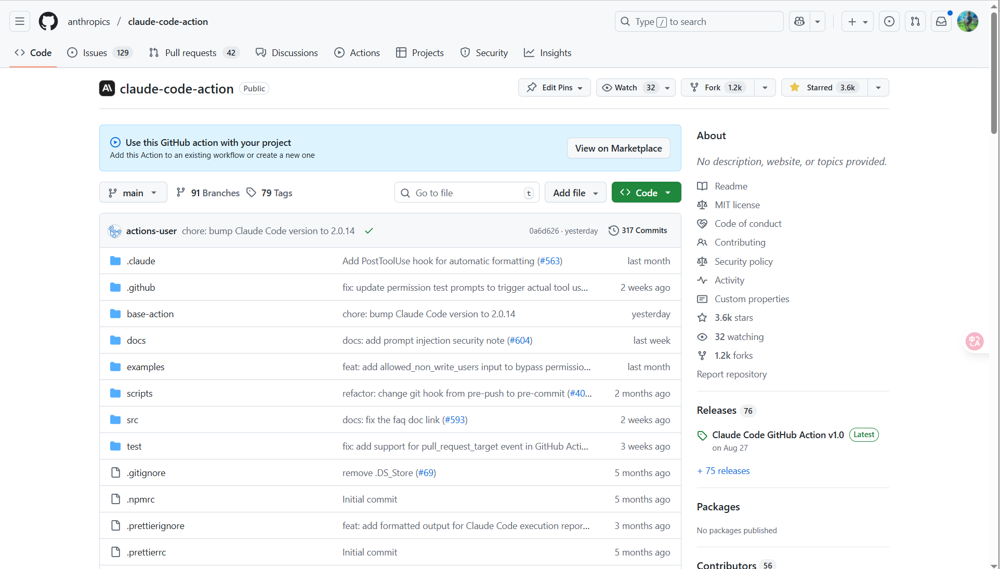
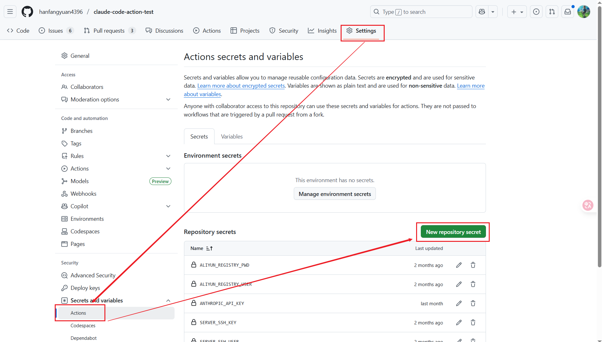
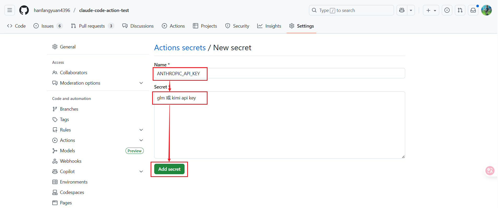
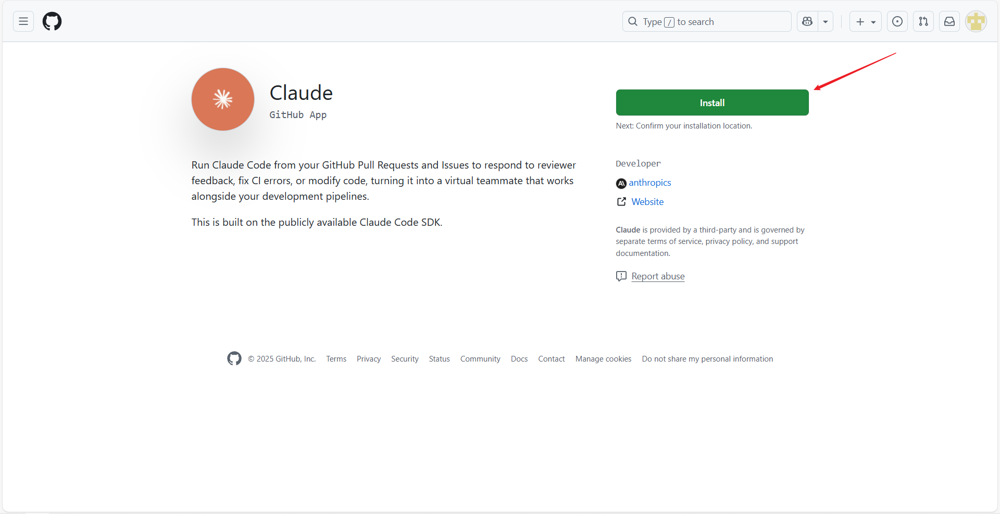
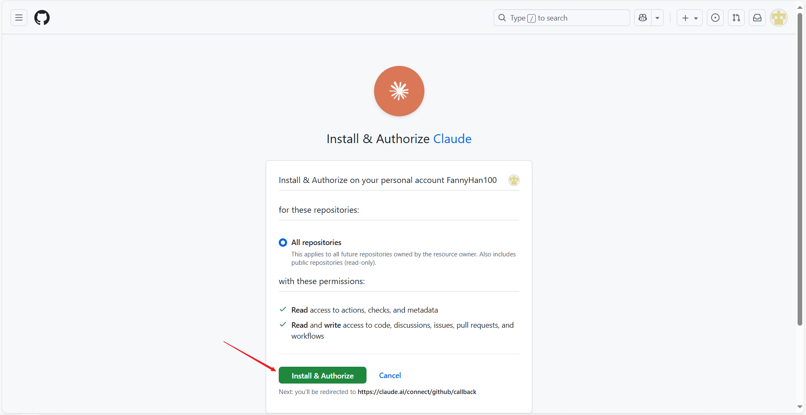

Q: claude code install github app 和 github official mcp 区别

在 Claude Code 中, "GitHub App" 和 "GitHub Official MCP" 是两种完全不同的集成方式. 前者侧重于**代码库的工作流与CI/CD自动化(事件驱动)**, 后者侧重于**AI的主动交互与代码操作(工具调用)**.

以下是两者的具体区别:

1. Claude GitHub App (GitHub 官方应用)

- 工作原理: 作为 GitHub 平台的一个原生应用安装在您的仓库中. 它通过监听 GitHub 事件(如 `@claude` 评论、提交、新建 Issue 或 PR)来触发自动化操作.
- 使用场景: 适合代码审查 (Code Review)、Issue/PR 的自动跟进和回复, 以及在云端或 CI/CD 流水线中的工作流协同.
- 权限与交互: Claude 将直接以机器人身份在 GitHub 界面上与团队成员互动, 提交评论或生成合并请求.
- 特点: 事件驱动、异步执行, 适合团队协作和平台级的工作流自动化.

2. GitHub Official MCP (GitHub 官方 MCP 服务)

- 工作原理: 基于 Model Context Protocol (MCP) 标准构建. 它将 Claude Code 变成一个"超级客户端", 使 Claude 能通过调用接口直接获取和操作您的 GitHub 数据.
- 使用场景: 适合本地编码和上下文检索. 例如, 当您在终端使用 Claude Code 编写代码时, 可以直接通过它拉取特定的 Issue 列表、检查合并请求状态, 甚至在代码中搜索公共或私有仓库.
- 权限与交互: 通过配置 GitHub Personal Access Token (PAT) 赋予 Claude 相应的读取和写入权限. 它在您当前的终端会话中运行, 完全听从您的直接指令.
- 特点: 按需调用 (Tool Calling)、同步执行, 将 Claude Code 变成更强大的个人端侧编程助手.

核心区别概览

| 对比维度 | Claude GitHub App                             | GitHub Official MCP                                           |
| -------- | --------------------------------------------- | ------------------------------------------------------------- |
| 本质     | 基于云端 Webhook 和 GitHub API 的自动化应用   | 基于 MCP 协议的本地工具扩展(提供 API 供模型调用)              |
| 触发方式 | GitHub 上的事件触发(如有人 @claude 评论)      | 终端中主动输入自然语言指令(如"帮我列出近期的 PR")             |
| 主要角色 | 仓库中的协作机器人(负责审查、CI/CD通知、留言) | 终端里的编程助手(负责直接读写代码、查日志、找资源)            |
| 使用环境 | 部署于 GitHub.com 或 GitHub Enterprise        | 运行于支持 MCP 的环境中, 如 Claude Code CLI 或 Claude Desktop |

总结建议: 如果您希望 Claude 能够在 GitHub 网页端自动审查您的 PR 或者回复 Issue, 请安装 Claude GitHub App; 如果您希望在终端使用 Claude Code 编程时, AI 能直接读取、搜索和操作您的 GitHub 远程仓库资源, 请配置[GitHub MCP Server](https://github.com/github/github-mcp-server). 两者的功能可以互补, 通常不冲突.

---------------------------------------------------------------------------------------------------

Q: claude code install github app 怎么使用

claude code 这种命令行工具可以很方便地集成到各种平台中, 本篇文章就是介绍如何把 claude code 快速接入到 github 中, 在开发流程中嵌入 AI 能力.

claude code 接入 github, 我们不需要重复造轮子, anthropic 官方提供并开源了名为 [claude code action](https://github.com/anthropics/claude-code-action) 的工具, claude code action 更新很频繁, 前段时间刚发布了正式版本 v1, 借助它可以快速把 claude code 集成到 github 中.

接下来按照配置 api key、在 github 安装 claude、让 claude code 参与开发 3 个步骤, 分享一下如何把 claude code 集成到 github.

### 配置 api key

claude 对国内账号封控很严重, 我们很难用到 claude 官方的 api, 好在国产模型进步很快, 并且都原生提供 anthropic 接口格式了, 可以作为 sonnet 的平替接入 claude code. 我测试 glm-4.6 和 kimi-k2 都能够驱动 claude code 正常运行. 可以在 https://bigmodel.cn/usercenter/proj-mgmt/apikeys 创建 glm 的 api key, 在 https://platform.moonshot.cn/console/api-keys 创建 kimi 的 api key, 然后在你期望接入 claude code 的github仓库中配置 api key.

进入 github 仓库中, 点击 settings, 然后选择 secrets and variables 中的 actions, 点击 new repository secret 按钮

在新打开的页面中填写 Name: ANTHROPIC_API_KEY, Secret: 你刚刚创建的 glm 或 kimi api key, 最后点击 add secret 配置成功

### 在 github 安装 claude

接下来, 需要在 GitHub 中安装 claude. 在浏览器打开 https://github.com/apps/claude, 进入 claude github app 页面, 点击 install 按钮安装 claude 应用, 如果按钮位置显示的不是 install 而是 configure, 表示已经安装过该应用.

然后在下面的安装确认页面中, 可以配置安装到所有仓库或者指定仓库中, 点击 install & authorize 按钮确认安装.

在安装成功后, 如果你的 github 仓库还没有 `.github/workflows` 目录, 你需要先创建该目录, 然后在该目录中添加 `claude.yml` 和 `claude-review.yml` 等[文件](https://github.com/anthropics/claude-code-action/tree/main/.github/workflows).

注意在上面两个文件中有 ANTHROPIC_BASE_URL 配置, 默认配置的是 glm 网址, 如果使用的 kimi 模型, 需要更改为 https://api.moonshot.cn/anthropic. 另外在配置文件最后有 --allowedTools 参数, claude code 使用的是工具白名单, 如果需要某个特定的工具, 需要配置到该参数中.

### 让 claude code 参与开发

执行完上述步骤, claude code 就已经接入到你的 github 仓库中了. 你可以在 github 中 issue 中评论 @claude, 让 ai 回答你的问题甚至可以让 ai 直接提交代码完成你的需求.

---------------------------------------------------------------------------------------------------

