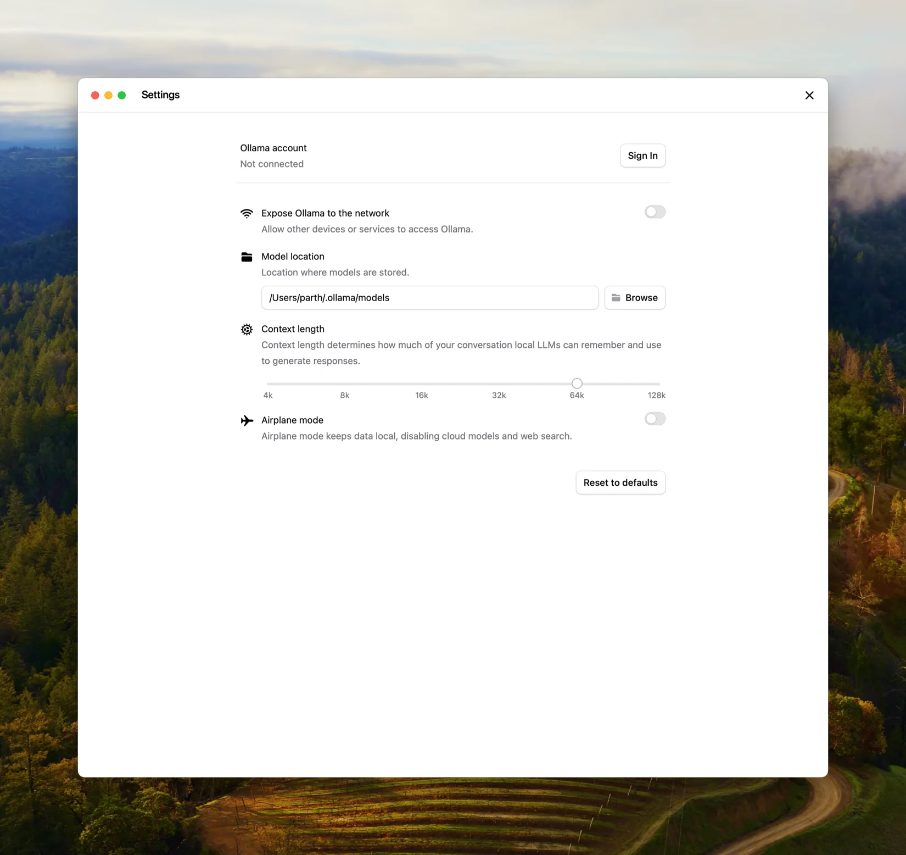

# Context length

* https://docs.ollama.com/context-length

Context length is the maximum number of tokens that the model has access to in memory.
上下文长度是指模型在内存中可以访问的最大标记数.

> Ollama defaults to the following context lengths based on VRAM:
> Ollama 默认使用以下基于 VRAM 的上下文长度:
> - < 24 GiB VRAM: 4k context
> - 24-48 GiB VRAM: 32k context
> - >= 48 GiB VRAM: 256k context
>

Tasks which require large context like web search, agents, and coding tools should be set to at least 64000 tokens.
需要大量上下文的任务, 例如网络搜索、代理和编码工具, 应至少设置为 64000 个 tokens.

## Setting context length

Setting a larger context length will increase the amount of memory required to run a model. Ensure you have enough VRAM available to increase the context length.
设置更大的上下文长度会增加运行模型所需的内存量. 请确保您有足够的显存 (VRAM) 来增加上下文长度.

Cloud models are set to their maximum context length by default.
云模型默认设置为其最大上下文长度.

### App

Change the slider in the Ollama app under settings to your desired context length.
在 Ollama 应用的设置中, 将滑块更改为您想要的上下文长度.



### CLI

If editing the context length for Ollama is not possible, the context length can also be updated when serving Ollama.
如果无法编辑 Ollama 的上下文长度, 也可以在提供 Ollama 时更新上下文长度.

```bash
OLLAMA_CONTEXT_LENGTH=64000 ollama serve
```

### Check allocated context length and model offloading
检查分配的上下文长度和模型卸载

For best performance, use the maximum context length for a model, and avoid offloading the model to CPU. Verify the split under `PROCESSOR` using `ollama ps`.
为了获得最佳性能, 请使用模型的最大上下文长度, 并避免将模型卸载到 CPU. 使用 `ollama ps` 在 `PROCESSOR` 下验证拆分.

```bash
ollama ps
```

```bash
NAME             ID              SIZE      PROCESSOR    CONTEXT    UNTIL
gemma4:latest    c6eb396dbd59    9.6 GB    100% GPU     131072     2 minutes from now
```
